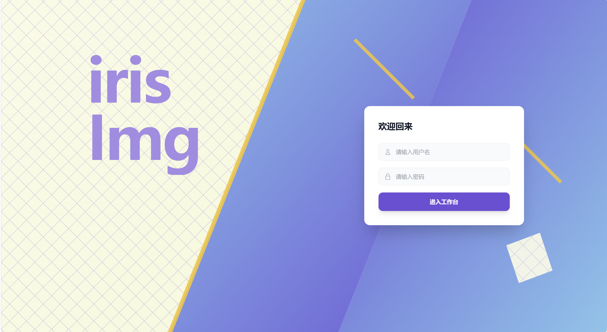
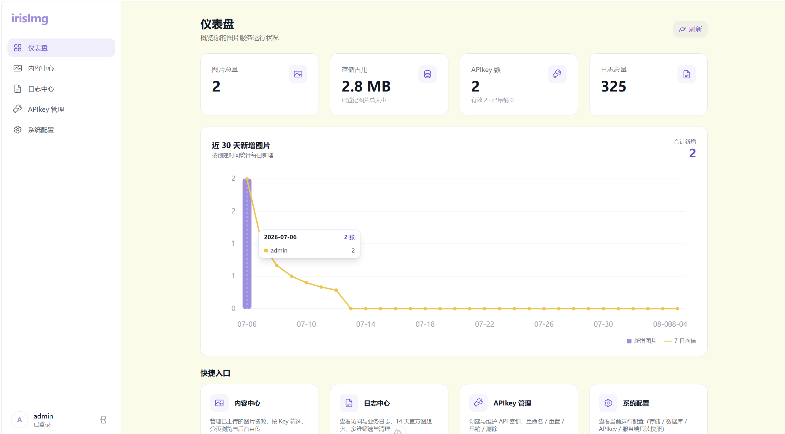
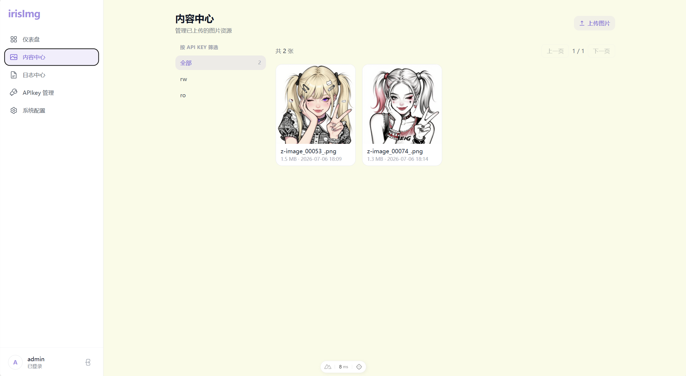
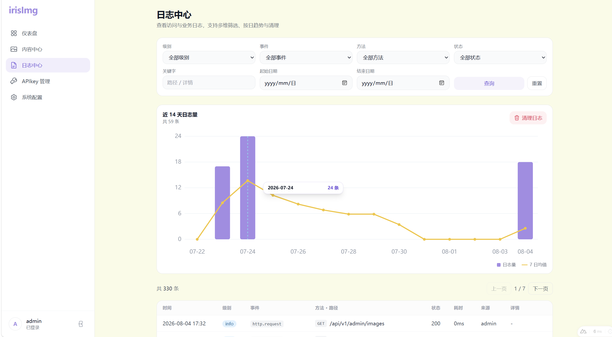
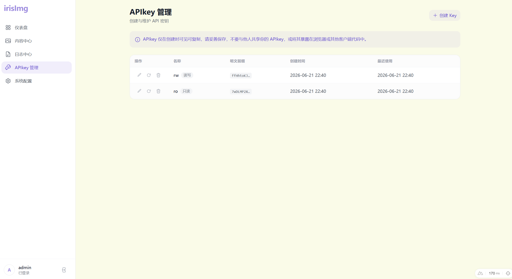

# irisImg

### 前言
因为感觉OSS对象存储服务有点贵，然后我刚好又买了个服务器，然后刚好又搭了个blog，然后刚好想给blog做前后端分离，然后发现后端写blog的时候上传图片有点麻烦 （~~*超绝不经意*~~） 所以现在想写个图床后端给我的blog用

## 简介

irisImg 是一个面向个人使用的轻量图床服务，前后端分离，**解压即用、简单配置、无需 Docker**。

- **后端**：Go (Gin) 单二进制，纯 Go SQLite 驱动（`modernc.org/sqlite`，无需 CGO，可交叉编译），业务接口统一挂在 `/api/v1`，图片静态服务挂在 `/imgs`。
- **前端**：Nuxt 4 + Vue 3 SPA（`ssr:false`），`pnpm generate` 产出纯静态站点，由 Nginx 直接 serve。
- **反代**：Nginx 同域反代，`/api/` 转发后端、`/imgs/` 直接 serve 落盘目录、`/` serve 前端 SPA。

除「本人登录后台管理」外，irisImg 另提供一套独立于 JWT 的 **API 密钥**鉴权体系，供外部程序（如博客后端）「添加图片」，并内建日志中心与仪表盘。后台覆盖六大模块：

| 模块 | 说明 |
| --- | --- |
| 登录认证 | 单用户模型 + HS256 JWT，常量时间比较防时序攻击，统一 401 防用户名枚举 |
| 内容中心 | 图片网格浏览、后台直传、SHA256 去重、真实 MIME 嗅探、原子写盘 |
| API Key 管理 | 明文仅展示一次、SHA-256 哈希存储、readonly/readwrite 双权限、按密钥令牌桶限流、敏感操作密码二次确认 |
| 日志中心 | 访问日志 + 业务审计统一落库，zap 异步批量写入，request id 串联，14 天纯 SVG 直方图（带 7 日移动平均） |
| 仪表盘 | 单接口聚合统计（图片总量 / 存储占用 / APIkey 计数 / 日志总量 / 近 N 天上传趋势，按来源拆分） |
| 系统配置 | 脱敏只读快照，剔除密码 / 用户名 / JWT 密钥 |

release 产物包含后端二进制、前端 SPA 静态产物、`.example` 示例配置与 Nginx 模板——后端就是一个可执行文件、前端由 Nginx 直接代理，因此本项目无需 Docker 构建。

> 当前版本 **v0.1.0**。功能特性、技术栈、安全特性、接口一览、部署升级与配置速览的完整说明见 [发布说明](docs/release/v0.1.0.md)。

## WebUI速览

*（感觉现在的登陆页面做的有点丑，以后有灵感时间了重新设计一张。。。）*

## 文档导航

项目所有说明文档集中在 [`docs/`](docs/) 下，与源码一一对应。README 仅作入口，细节请按需查阅：

- **[发布说明 (v0.1.0)](docs/release/v0.1.0.md)** — 功能特性、技术栈、安全特性、接口一览、部署升级、配置速览、已知限制。
- **[部署与 Release 打包](docs/deploy.md)** — 部署架构、打包流程、Nginx 反代约定、构建坑防护。
- **后端**
  - [目录对照与入口阅读顺序](docs/backend/README.md)
  - 特性文档：[登录认证 AUTH](docs/backend/AUTH.md) · [API 密钥 APIKEY](docs/backend/APIKEY.md) · [图片上传 IMAGE](docs/backend/IMAGE.md) · [日志中心 LOG](docs/backend/LOG.md) · [仪表盘 DASHBOARD](docs/backend/DASHBOARD.md) · [数据库 DATABASE](docs/backend/DATABASE.md)
- **前端**
  - [目录对照与分层说明](docs/frontend/README.md)
  - [前端登录链路 AUTH](docs/frontend/AUTH.md)
